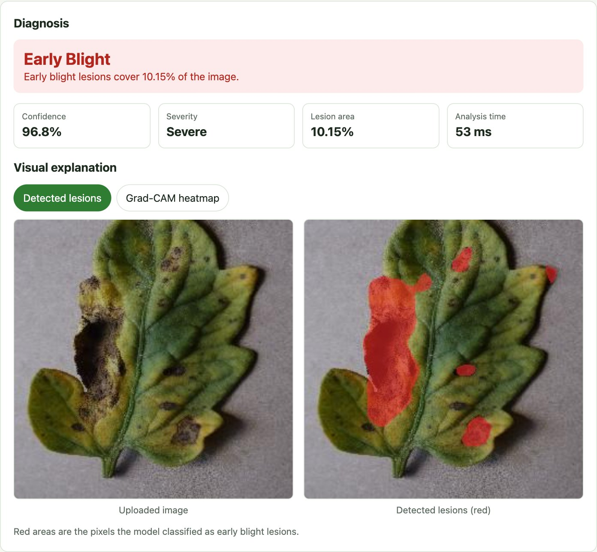
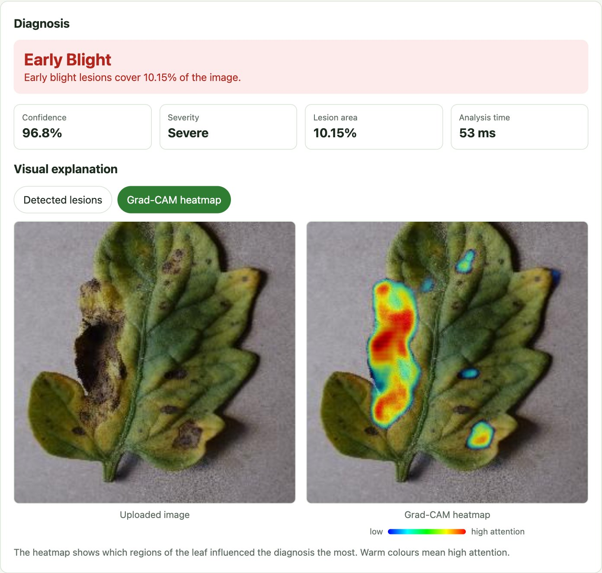
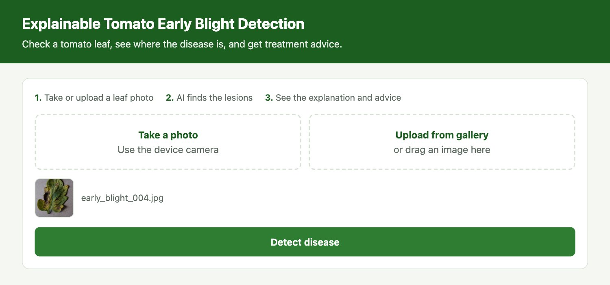
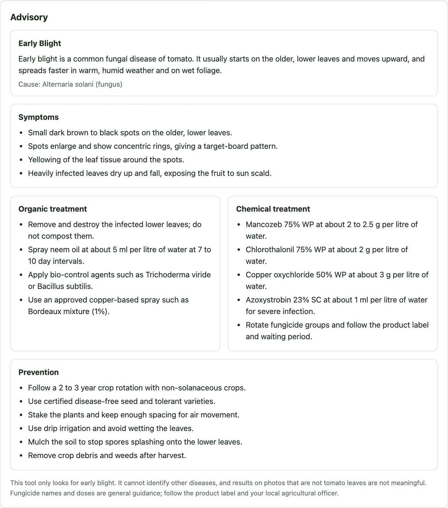

# Explainable Tomato Early Blight Detection

A web application that checks a tomato leaf photo for **early blight**, shows
where the disease is, and gives treatment and prevention advice.

- **Diagnosis** - Healthy or Early Blight, with confidence, lesion area and a
  Mild / Moderate / Severe grade
- **Explanation** - a lesion overlay from the segmentation mask and a Grad-CAM
  heatmap
- **Advisory** - symptoms, organic and chemical treatment, and prevention steps
  from a SQLite knowledge base
- **Input** - device camera or image upload, in any modern browser

| Diagnosis and lesion overlay | Grad-CAM heatmap |
|---|---|
|  |  |

| Home | Advisory |
|---|---|
|  |  |

## How it works

1. The browser sends the leaf image to the Flask server (`POST /predict`).
2. The image is resized to 256 x 256 and scaled to [-1, 1].
3. A MobileNetV2 U-Net predicts, for every pixel, the probability that it is an
   early blight lesion.
4. Pixels above 0.5 count as lesion. Below 0.2% lesion area the leaf is
   reported Healthy; otherwise Early Blight, graded by area.
5. Grad-CAM is computed on a decoder layer to show which regions drove the
   result.
6. The advisory for the diagnosis is read from SQLite and returned with the
   result.

## Run

Requires Python 3.11.

```bash
python3.11 -m venv .venv
.venv/bin/pip install -r requirements.txt
.venv/bin/python app.py
```

Open http://127.0.0.1:5050.

To open it from a phone on the same Wi-Fi, change `host="127.0.0.1"` to
`host="0.0.0.0"` at the bottom of `app.py` and browse to the computer's IP
address on port 5050.

## Project structure

```
app.py                  Flask routes: /, /predict, /health
detector.py             model loading, diagnosis logic, Grad-CAM, overlays
knowledge.py            SQLite knowledge base (knowledge.db is created on first run)
templates/index.html    the web page
model/                  early_blight_unet.keras (MobileNetV2 U-Net, 58 MB)
evaluation/             test scripts and results
docs/screenshots/       images used in this README
```

## Settings

At the top of `detector.py`:

| Constant | Default | Meaning |
|---|---|---|
| `PIXEL_THRESHOLD` | 0.5 | probability above which a pixel counts as lesion |
| `HEALTHY_MAX_AREA` | 0.2 | lesion area (% of image) below which a leaf is Healthy |
| `MODERATE_MIN_AREA` | 3.0 | lesion area from which early blight is Moderate |
| `SEVERE_MIN_AREA` | 10.0 | lesion area from which early blight is Severe |
| `LOW_CONFIDENCE` | 60.0 | confidence below which the user is asked to retake the photo |

## Evaluation

The app was tested by sending 650 randomly sampled
[PlantVillage](https://github.com/spMohanty/PlantVillage-Dataset) tomato images
through the running server.

| 250 Early Blight + 250 Healthy | Result |
|---|---|
| Accuracy | 94.4% |
| Precision | 96.25% |
| Recall | 92.4% |
| Specificity | 96.4% |
| F1-score | 94.29% |
| Mean response time (CPU, local) | 52.6 ms |

To reproduce, start the app and then run:

```bash
.venv/bin/python evaluation/download_test_images.py
.venv/bin/python evaluation/evaluate.py
```

Per-image results are in `evaluation/results.csv` and the summary in
`evaluation/summary.json`.

## Limitations

- The model only knows early blight. It marks lesions of other diseases too:
  131 of 150 Late Blight and Septoria test images were reported as Early Blight.
- The test images come from PlantVillage (single leaf, plain background). If
  the model was trained on PlantVillage, the figures above are not an
  independent test, and accuracy on field photos is not yet measured.
- Lesion area is a percentage of the whole image, not of the leaf.
- Fungicide names and doses in the advisory are general guidance. Follow the
  product label and local agricultural advice.
- `app.py` starts Flask's development server, which is not meant for public
  hosting.
